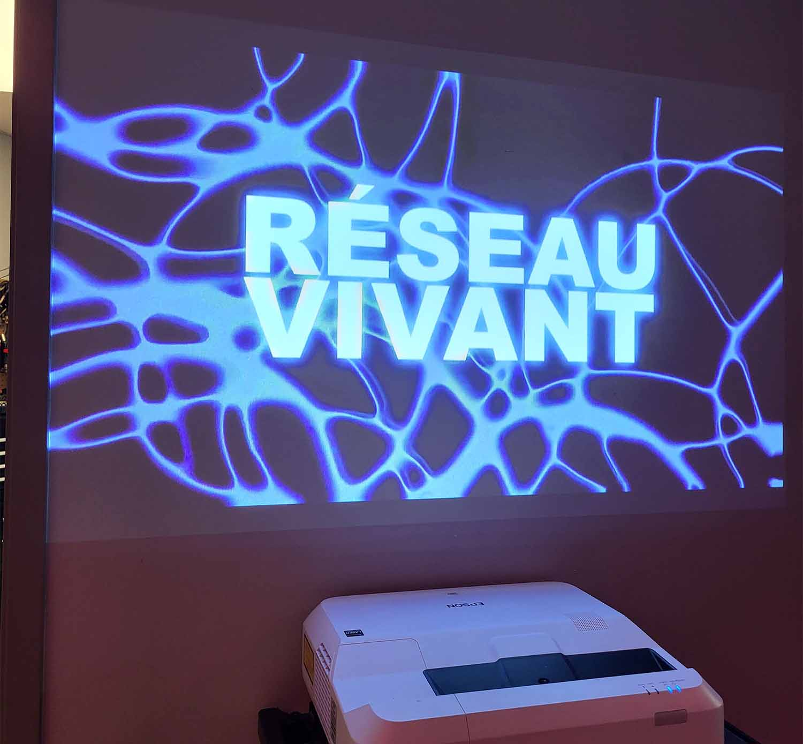
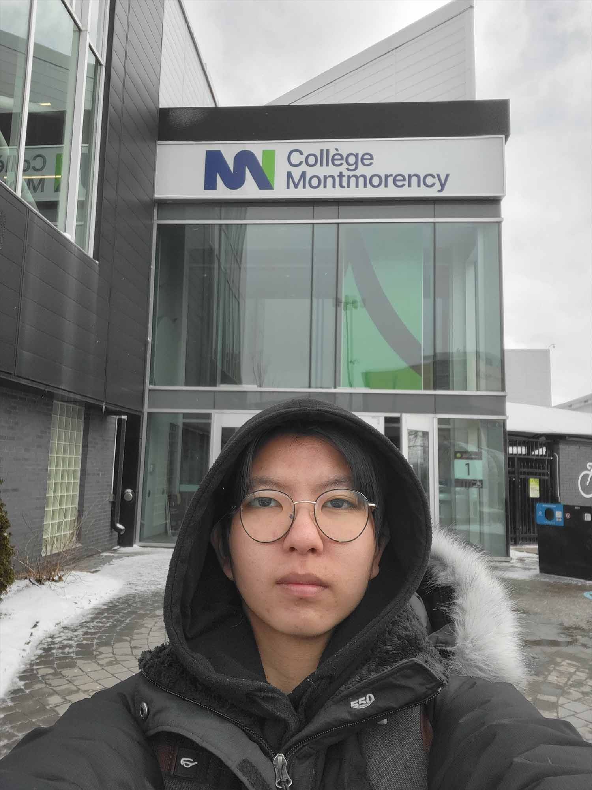
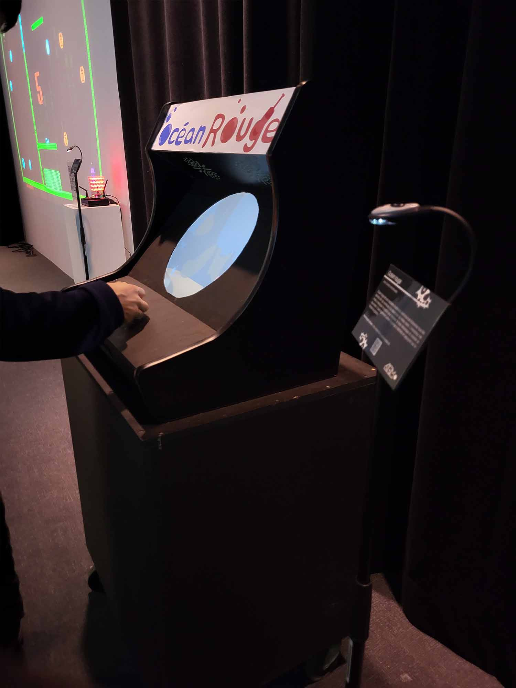
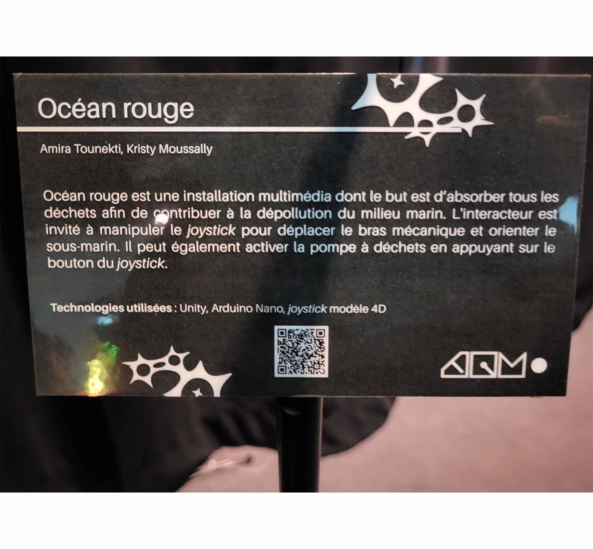
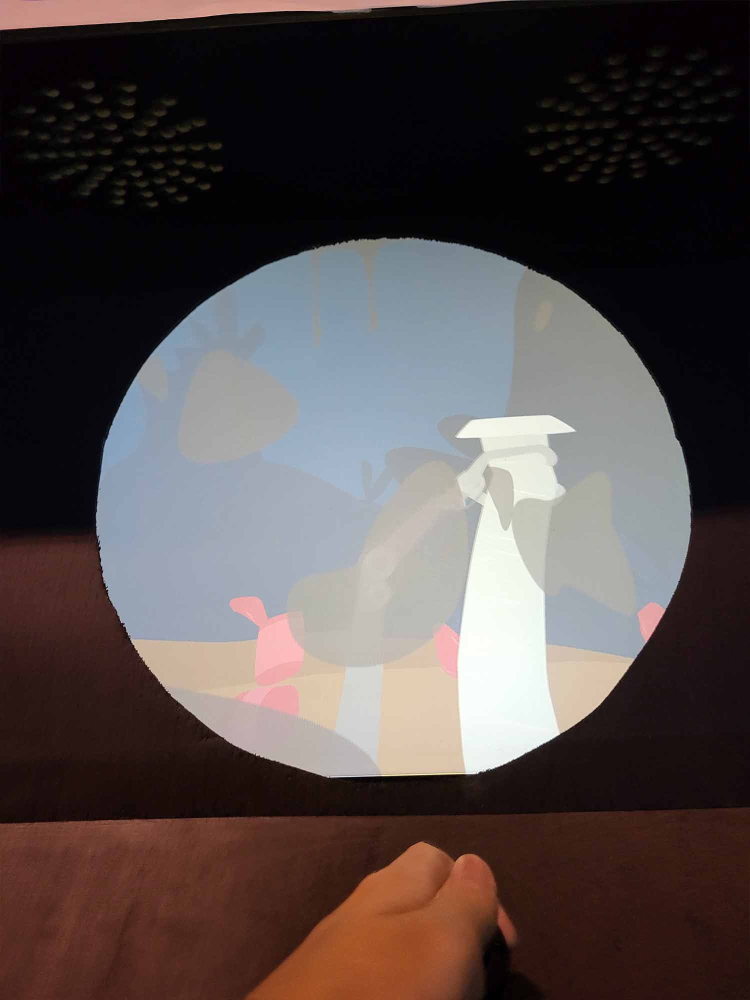
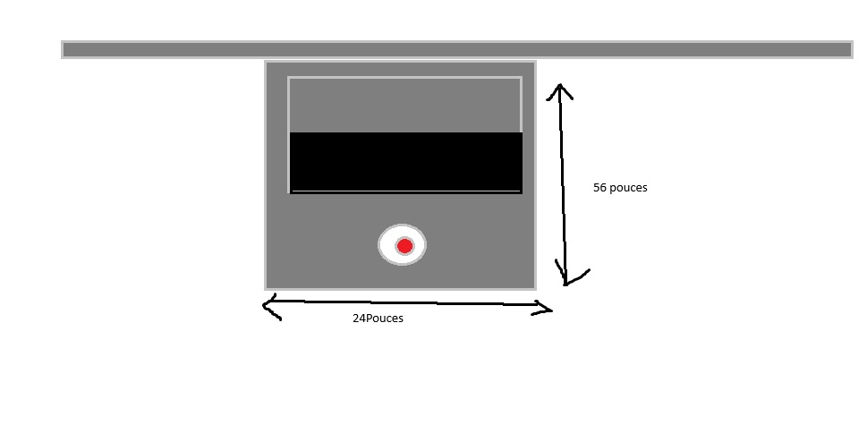

# Réseau vivant
Affiche de l'exposition

  

> Affiche de l'exposition 

## <ins>**Lieu de mise en exposition:**</ins>  

  

> moi devant l'entrée de l'édifice où l'exposition a lieu: <a href="https://www.cmontmorency.qc.ca/"> Montmorency</a>

### <ins>**Type d'exposition:**</ins>  
Temporaire & intérieure

### <ins>**Date de visite:**</ins>  
17/03/2026

### <ins>**Titre de l'oeuvre: Océan rouge**</ins>  
Vue d'ensemble de l'oeuvre ou du dispositif  
  

> Photo de vue d'ensemble de l'oeuvre

### <ins>**nom de l'artiste:**</ins>
Amira Touneki, Kristy Moussally

### <ins>**Année de réalisation:**:</ins> 2026  

### <ins>**Description de l'oeuvre:**</ins>  
> Le projet se nomme Océan Rouge. Il s’agit d’une installation multimédia dont le but est de transmettre et de créer un mouvement collectif engendrant des changements positifs pour l’ensemble des êtres vivants.
Nous souhaitons faire ressentir aux interacteurs de notre projet la sensation de faire partie d’un mouvement de sauvetage de la flore et la faune marine.
Le son du projet soutiendra ce message à travers une sonorité sombre, créant ainsi un sentiment d’urgence incitant l’interacteur à agir pour sauver un espace agonisant.
> Description prise sur le siteweb Source: https://deux-intelligence.github.io/deux-neurones/#/
>  

> cartel de l'oeuvre

### <ins>**Type d'installation:**</ins>  
Intéractive, il est possible d'intéragir avec l'installation     
  

> Photo de l'installation lorsqu'on intéragis avec celle-ci

### <ins>**Mise en espace:**</ins>  
L'oeuvre est positionné à-cotée sur un mur. Le noir est l'écran, les ronds la manette pour intéragir et le rectangle du haut est le mur.
  

> Croquis vue de haut de l'oeuvre

### <ins>**Composantes et techniques:**</ins>  
Boite d'arcade, moniteur, ordinateur, haut-ârleur, manette de jeux  

> Photo de l'oeuvre
 

> photo de manette de jeux prise sur <a href="https://grupogalf.cl/product/joystick-aeroplano/">https://grupogalf.cl/product/joystick-aeroplano/</a>
 
> Plusieurs photos des composantes du dispositif

### <ins>**Éléments nécessaires à la mise en exposition:**</ins>  
Stand, câble d'alimentation et lumìeres  
  

> Photo de l'oeuvre

### <ins>**Éxpérience vécue:**</ins>  
Il faut manipuler la manette pour aspirer tout les déchets qui apparaits à l'écran. Il est possible de tourner la manette pour se déplacer vers  
la gauche et la droite, il faut appuyer sur un bouton situé sur le dessus de la manette pour activer l'aspiration. Plus on aspire de déchets,  
plus des plantes et des animaux marins apparaissent. Si on aspire pas d'objets pendant trop longtemps, la partie se termine.

### <ins>**Ce qui m'a plu ou donné des idées**</ins>  
J'aime beaucoup la fausse effet de 2D afin de donner la possibilité au joueur de tourner de droite à gauche pour tourner en rond. En tournant à gauche complètement le jour va revenir au point de départ, comme s'il avait fait une rotation de 360. 

### <ins>**Aspects que je ne souhaiteriais pas retenir pour mes propres créations ou que je ferais autrement:**</ins>  
La limite de temps à être sans aspirer d'objet est trop rapide et rend le jeux difficile. Dans le jeux, le mouvement de l'aspirateur est également trop rapide et il est difficile de bien manipuler la manette pour compenser cette difficulté.

### Références  
Toutes photos sauf avec indication du contraire, ont été prise par Jessi McMullen.  
Siteweb de l'exposition "Réseau vivant": <a href="https://tim-montmorency.com/2026/">https://tim-montmorency.com/2026/</a>
