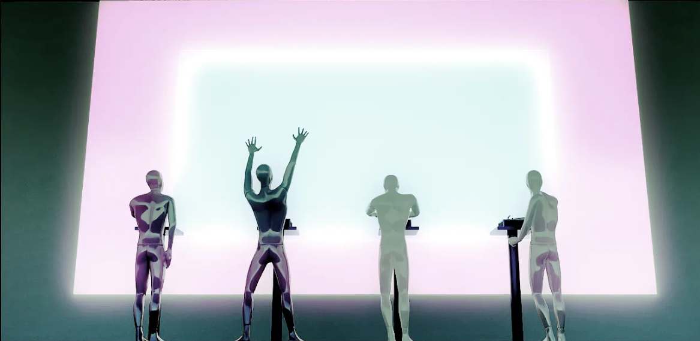
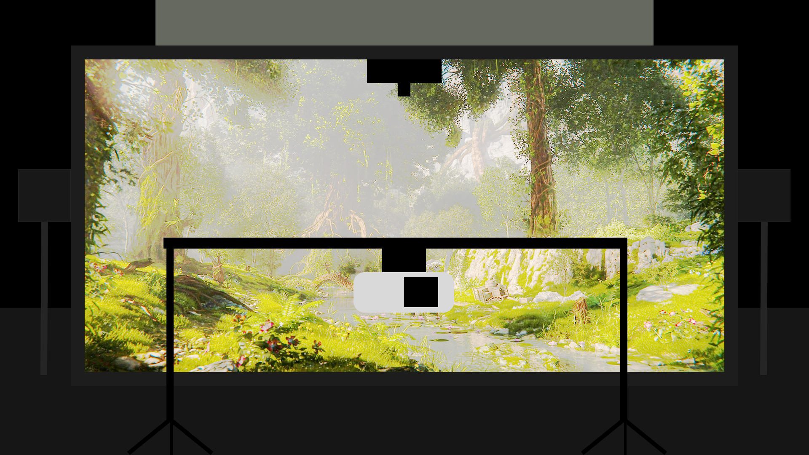

### No ordre de préférence  

### Titre du projet  
Terminal

### Noms des créateurs et créatrices  
Émeryk Bélisle, Elie Daher, Ting Yung Lu Terry, Dana Saavedra-Torrano, Mégane Ranger

### Installation en cours (ou finale)  
photo à prendre

### Schéma de l'installation prévue  
  
> Schéma 3D de l'installation prévu

### Ce que vous ressentez en expérimentant chacune des installations,  
Avant, 

Après je sens mon coeur battre vie à cause de la concentration que l'installation demande et la vitesse auquel il faut réagir 

### Nommer 3 cours du programme qui vous semblent incontournables pour avoir les
compétences pour créer ce genre de projet (voir la grille de cours du programme)  
Audio 1, web ?, installation multimédia

### Nommer et décrire une technique ou une composante technologique qui est utilisée dans le projet et que vous ne connaissiez pas.  

-----

### No ordre de préférence  

### Titre du projet  
O.I.G.N.O.N.  
Mission Décollage

### Noms des créateurs et créatrices  
Ahmed Kaissoumi
Radhouane Kordan
Justin Montpetit
Thearylou Lach
Jad Saloumi

### Installation en cours (ou finale)  

### Schéma de l'installation prévue  
  
> Schéma 3D de l'installation

### Ce que vous ressentez en expérimentant chacune des installations,
avec justification (avant/après l'expérimentation)  
Après je me sens dépassé par le nombre de comtrôle à manipuler pour jouer et le nombre de chose qu'il faut tenir compte lors de l'expérience.

### Nommer 3 cours du programme qui vous semblent incontournables pour avoir les
compétences pour créer ce genre de projet (voir la grille de cours du programme)  
Objects intéractifs, Audio 2, Traitement audiovisuel

### Nommer et décrire une technique ou une composante technologiqu equi est utilisée dans le projet et que vous ne connaissiez pas.  

-----

### No ordre de préférence  
1
### Titre du projet  
Océan rouge
### Noms des créateurs et créatrices  

### Installation en cours (ou finale)  

### Schéma de l'installation prévue  
  
> Schéma 3D de l'installation
### Ce que vous ressentez en expérimentant chacune des installations,
avec justification (avant/après l'expérimentation)  

### Nommer 3 cours du programme qui vous semblent incontournables pour avoir les
Animation 2D, Modélisation 3D, Objets intéractifs

### Nommer et décrire une technique ou une composante technologique qui est utilisée dans le projet et que vous ne connaissiez pas.  

Module intéractif, une composante qui assure la communication entre un manche de manette de jeux et un ordinateur.
-----

### No ordre de préférence  

### Titre du projet  
Symbiose

### Noms des créateurs et créatrices  
Yannick Chamberland
Benjamin Ferland
Ryan Dufault
Walid Cheour

### Installation en cours (ou finale)  

### Schéma de l'installation prévue  
  
> Schéma 3D de l'installation
### Ce que vous ressentez en expérimentant chacune des installations,
Après, je me suis amusé, j'ai encore envie de faire l'expérience malgré le fait de me sentir confus par rapport à ce que je devait faire pour intéragir avec. Ce n'était pas intuitif pour moi.

### Nommer 3 cours du programme qui vous semblent incontournables pour avoir les
Modélisation 3D, Pogrammation intéractif, Réalité Mixte

### Nommer et décrire une technique ou une composante technologique qui est utilisée dans le projet et que vous ne connaissiez pas.  
Arduino, un objet de robotique qui sert à envoyer des données à un ordinateur.

-----

### No ordre de préférence  

### Titre du projet  
Quand les yeux se croisent
### Noms des créateurs et créatrices  

### Installation en cours (ou finale)  

### Schéma de l'installation prévue  
  
> Schéma 3D de l'installation
### Ce que vous ressentez en expérimentant chacune des installations,
avec justification (avant/après l'expérimentation)  

### Nommer 3 cours du programme qui vous semblent incontournables pour avoir les
compétences pour créer ce genre de projet (voir la grille de cours du programme)  

### Nommer et décrire une technique ou une composante technologique qui est utilisée dans le projet et que vous ne connaissiez pas.  

-----

### No ordre de préférence  
2
### Titre du projet  
Arbre en face
### Noms des créateurs et créatrices  
Alexandre Gendron  
Mikael Arseneau  
Mathieu Willett  
Matis Ghariani  
Rafael Angon Dube  

### Installation en cours (ou finale)  

### Schéma de l'installation prévue  
  
> Schéma 3D de l'installation
### Ce que vous ressentez en expérimentant chacune des installations  
avec justification (avant/après l'expérimentation)  

Après je ressens de la joie et du rire. Je trouve l'installation amusant et coloré et originale.

### Nommer 3 cours du programme qui vous semblent incontournables pour avoir les
Traitement visuel, AUdio 2, programmation

### Nommer et décrire une technique ou une composante technologique qui est utilisée dans le projet et que vous ne connaissiez pas.  
Un lidar, une composante qui produit un rayon laser qui tourne pour capter les mouvements et les transmettrent à un ordinateur.

