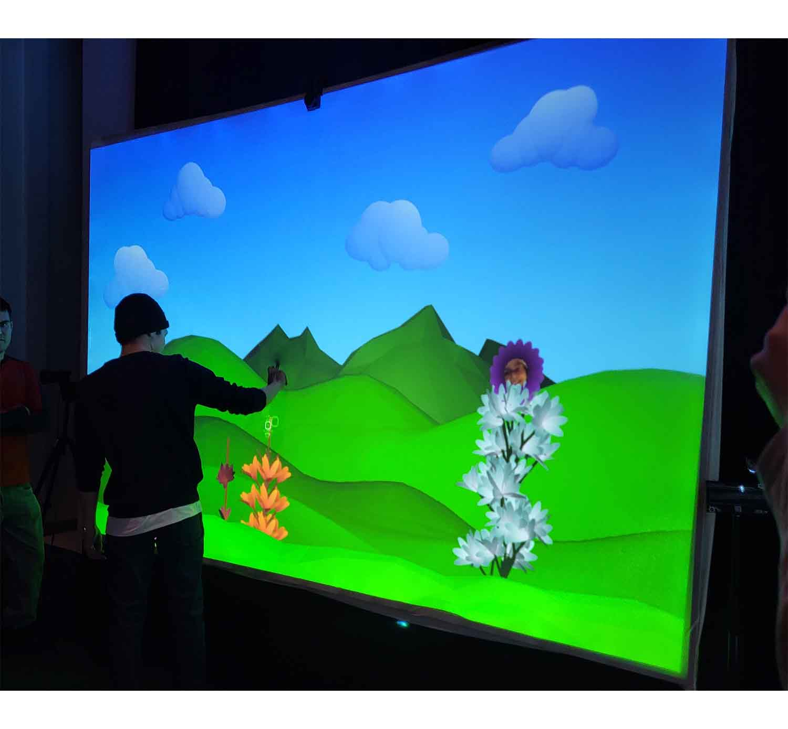
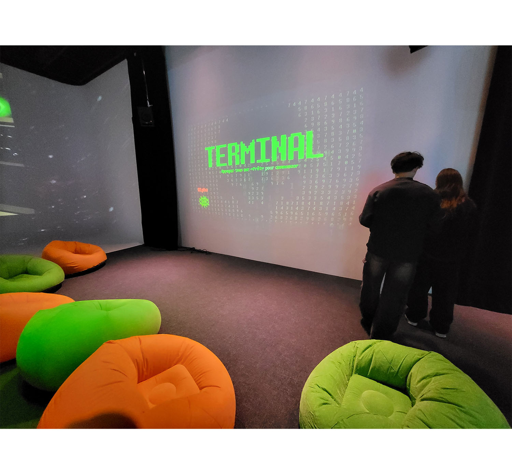
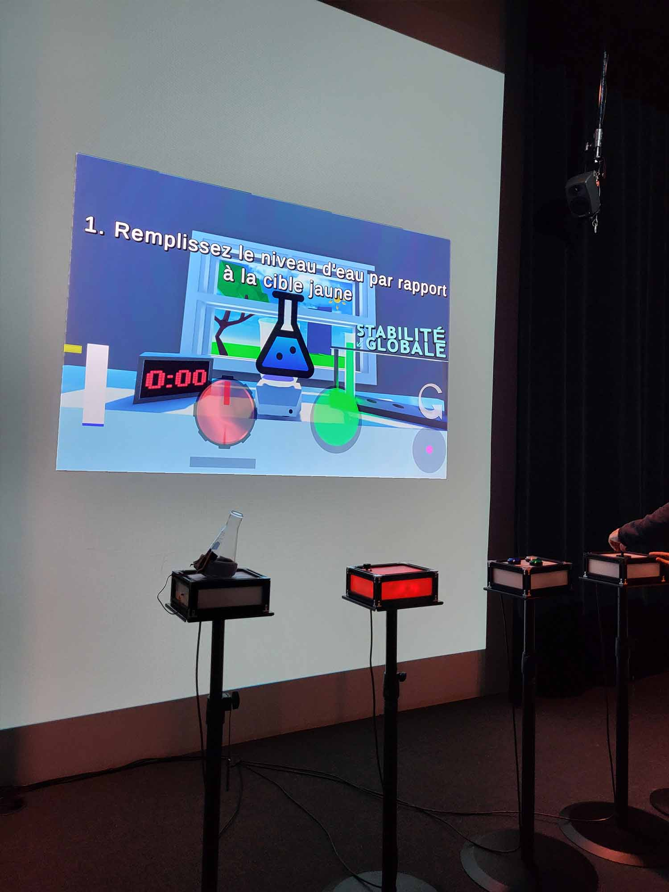
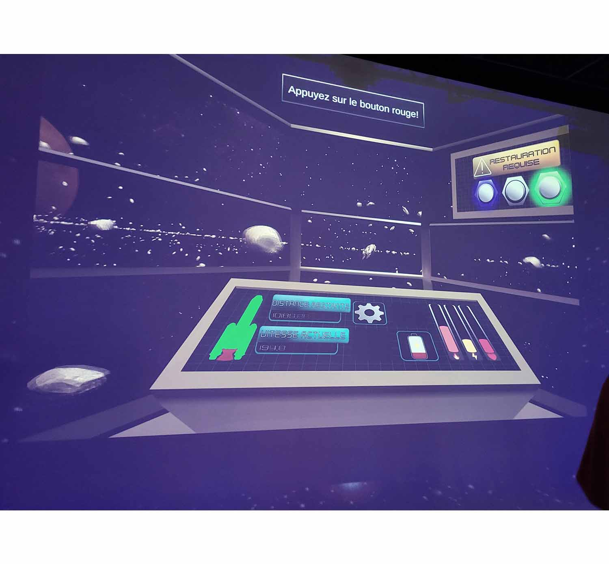
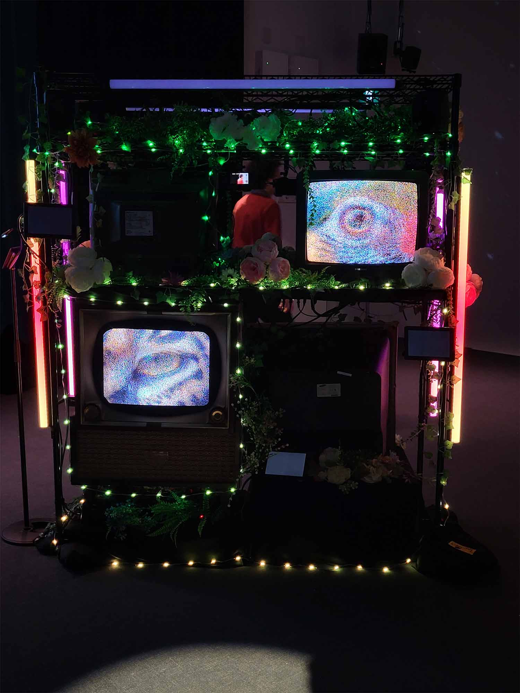

### No ordre de préférence  
2
### Titre du projet  
Arbre en face
### Noms des créateurs et créatrices  
Alexandre Gendron, Mikael Arseneau  
Mathieu Willett  
Matis Ghariani  
Rafael Angon Dube  

### Installation en cours (ou finale)  
  

> Photo de l'oeuvre "Arbre en face" prise par Jessi McMullen

### Schéma de l'installation prévue  
  

> Schéma 3D de l'installation  
> Source de l'image: https://mammouths.github.io/projet/#/

### Ce que vous ressentez en expérimentant l'installations  
Après je ressens de la joie et du rire. Je trouve l'installation amusant et coloré et originale.

-----

### No ordre de préférence  
3
### Titre du projet  
Terminal

### Noms des créateurs et créatrices  
Émeryk Bélisle, Elie Daher, Ting Yung Lu Terry, Dana Saavedra-Torrano, Mégane Ranger

### Installation en cours (ou finale)  
  

> Photo de l'oeuvre "Terminal" prise par Jessi McMullen

### Schéma de l'installation prévue  
  

> Schéma 3D de l'installation prévu
> Source de l'image: https://pythons-5.github.io/Terminal/#/

### Ce que vous ressentez en expérimentant l'installations  
Après je sens mon coeur battre vie à cause de la concentration que l'installation demande et la vitesse auquel il faut réagir 

-----

### No ordre de préférence  
4
### Titre du projet  
Symbiose 

### Noms des créateurs et créatrices  
Yannick Chamberland, Benjamin Ferland, Ryan Dufault, Walid Cheour

### Installation en cours (ou finale)  
  

> Photo de l'oeuvre "Symbiose" prise par Jessi McMullen

### Schéma de l'installation prévue  
  

> Schéma 3D de l'installation  
> Source de l'image: https://les-chimistes.github.io/symbiose/#/

### Ce que vous ressentez en expérimentant l'installations  
Après, je me suis amusé, j'ai encore envie de faire l'expérience malgré le fait de me sentir confus par rapport à ce que je devait faire pour intéragir avec. Ce n'était pas intuitif pour moi et j'étais confus. 

-----

### No ordre de préférence  
5
### Titre du projet  
O.I.G.N.O.N.  
Mission Décollage

### Noms des créateurs et créatrices  
Ahmed Kaissoumi, Radhouane Kordan, Justin Montpetit, Thearylou Lach ,Jad Saloumi

### Installation en cours (ou finale)  
  

> Photo de l'oeuvre "O.I.G.N.O.N. mission décollage" prise par Jessi McMullen

### Schéma de l'installation prévue  
  

> Schéma 3D de l'installation  
> Source de l'image: https://o-i-g-n-o-n.github.io/Mission-decollage/#/

### Ce que vous ressentez en expérimentant l'installations  
Après je me sens dépassé par le nombre de comtrôle à manipuler pour jouer et le nombre de chose qu'il faut tenir compte lors de l'expérience.

-----

### No ordre de préférence  
6

### Titre du projet  
Quand les yeux se croisent
### Noms des créateurs et créatrices  

### Installation en cours (ou finale)  
  

> Photo de l'oeuvre "Quand les yeux se croisent" par Jessi McMullen

### Schéma de l'installation prévue  
  

> Schéma 3D de l'installation  
> Source de l'image: https://emersiaa.github.io/Quand-les-yeux-se-croisent/#/

### Ce que vous ressentez en expérimentant l'installations  
Je me sens émerveillé, curieux, relaxé. La musique et les effets visuels m'apaise.

-----

### Nommer 3 cours du programme qui vous semblent incontournables pour réaliser un projet similaire   
Traitement visuel, AUdio 2, programmation intéractive  
Ces trois cours sont nécessaires afin de réaliser un projet tel que <a href="https://mammouths.github.io/projet/#/"> Arbre en face</a>

### Nommer et décrire une technique ou une composante technologique qui est utilisée dans le projet "Arbre en face"  et que vous ne connaissiez pas.  
Un lidar, une composante qui produit un rayon laser qui tourne pour capter les mouvements et les transmettrent à un ordinateur.
Information trouvé aux côtés des artistes de l'oeuvre "Arbre en face"

