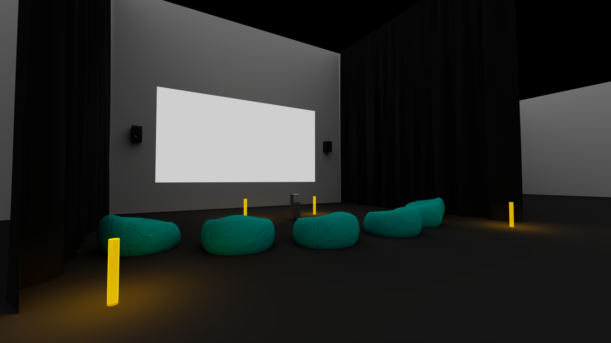

### No ordre de préférence  

### Titre du projet  
Terminal

### Noms des créateurs et créatrices  
Émeryk Bélisle, Elie Daher, Ting Yung Lu Terry, Dana Saavedra-Torrano, Mégane Ranger

### Installation en cours (ou finale)  
photo à prendre

### Schéma de l'installation prévue  
  
> Schéma 3D de l'installation prévu

### Ce que vous ressentez en expérimentant chacune des installations,  
Avant, 

Après je sens mon coeur battre vie à cause de la concentration que l'installation demande et la vitesse auquel il faut réagir 

### Nommer 3 cours du programme qui vous semblent incontournables pour avoir les
compétences pour créer ce genre de projet (voir la grille de cours du programme)  
Audio 1, web ?, installation multimédia

### Nommer et décrire une technique ou une composante technologique qui est
utilisée dans l'un des projets et que vous ne connaissiez pas.  

-----

### No ordre de préférence  

### Titre du projet  
O.I.G.N.O.N.  
Mission Décollage

### Noms des créateurs et créatrices  
Ahmed Kaissoumi
Radhouane Kordan
Justin Montpetit
Thearylou Lach
Jad Saloumi

### Installation en cours (ou finale)  

### Schéma de l'installation prévue  
  
> Schéma 3D de l'installation

### Ce que vous ressentez en expérimentant chacune des installations,
avec justification (avant/après l'expérimentation)  
Après je me sens dépassé par le nombre de comtrôle à manipuler pour jouer et le nombre de chose qu'il faut tenir compte lors de l'expérience.

### Nommer 3 cours du programme qui vous semblent incontournables pour avoir les
compétences pour créer ce genre de projet (voir la grille de cours du programme)  
Objects intéractifs, Audio 2, Traitement audiovisuel

### Nommer et décrire une technique ou une composante technologique qui est
utilisée dans l'un des projets et que vous ne connaissiez pas.  

-----

### No ordre de préférence  
1
### Titre du projet  
Océan rouge
### Noms des créateurs et créatrices  

### Installation en cours (ou finale)  

### Schéma de l'installation prévue  
  
> Schéma 3D de l'installation
### Ce que vous ressentez en expérimentant chacune des installations,
avec justification (avant/après l'expérimentation)  

### Nommer 3 cours du programme qui vous semblent incontournables pour avoir les
compétences pour créer ce genre de projet (voir la grille de cours du programme)  

### Nommer et décrire une technique ou une composante technologique qui est
utilisée dans l'un des projets et que vous ne connaissiez pas.  

-----

### No ordre de préférence  

### Titre du projet  
Mission Décollage

### Noms des créateurs et créatrices  
Ahmed Kaissoumi
Radhouane Kordan
Justin Montpetit
Thearylou Lach
Jad Saloumi

### Installation en cours (ou finale)  

### Schéma de l'installation prévue  
  
> Schéma 3D de l'installation
### Ce que vous ressentez en expérimentant chacune des installations,
avec justification (avant/après l'expérimentation)  

### Nommer 3 cours du programme qui vous semblent incontournables pour avoir les
compétences pour créer ce genre de projet (voir la grille de cours du programme)  

### Nommer et décrire une technique ou une composante technologique qui est
utilisée dans l'un des projets et que vous ne connaissiez pas.  

-----

### No ordre de préférence  

### Titre du projet  

### Noms des créateurs et créatrices  

### Installation en cours (ou finale)  

### Schéma de l'installation prévue  
  
> Schéma 3D de l'installation
### Ce que vous ressentez en expérimentant chacune des installations,
avec justification (avant/après l'expérimentation)  

### Nommer 3 cours du programme qui vous semblent incontournables pour avoir les
compétences pour créer ce genre de projet (voir la grille de cours du programme)  

### Nommer et décrire une technique ou une composante technologique qui est
utilisée dans l'un des projets et que vous ne connaissiez pas.  

-----

### No ordre de préférence  

### Titre du projet  

### Noms des créateurs et créatrices  

### Installation en cours (ou finale)  

### Schéma de l'installation prévue  
  
> Schéma 3D de l'installation
### Ce que vous ressentez en expérimentant chacune des installations,
avec justification (avant/après l'expérimentation)  

### Nommer 3 cours du programme qui vous semblent incontournables pour avoir les
compétences pour créer ce genre de projet (voir la grille de cours du programme)  

### Nommer et décrire une technique ou une composante technologique qui est
utilisée dans l'un des projets et que vous ne connaissiez pas.  

-----

### No ordre de préférence  

### Titre du projet  

### Noms des créateurs et créatrices  

### Installation en cours (ou finale)  

### Schéma de l'installation prévue  
  
> Schéma 3D de l'installation
### Ce que vous ressentez en expérimentant chacune des installations,
avec justification (avant/après l'expérimentation)  

### Nommer 3 cours du programme qui vous semblent incontournables pour avoir les
compétences pour créer ce genre de projet (voir la grille de cours du programme)  

### Nommer et décrire une technique ou une composante technologique qui est
utilisée dans l'un des projets et que vous ne connaissiez pas.  

-----

### Nommer et décrire une technique ou une composante technologique qui est
utilisée dans l'un des projets et que vous ne connaissiez pas.\

-----

