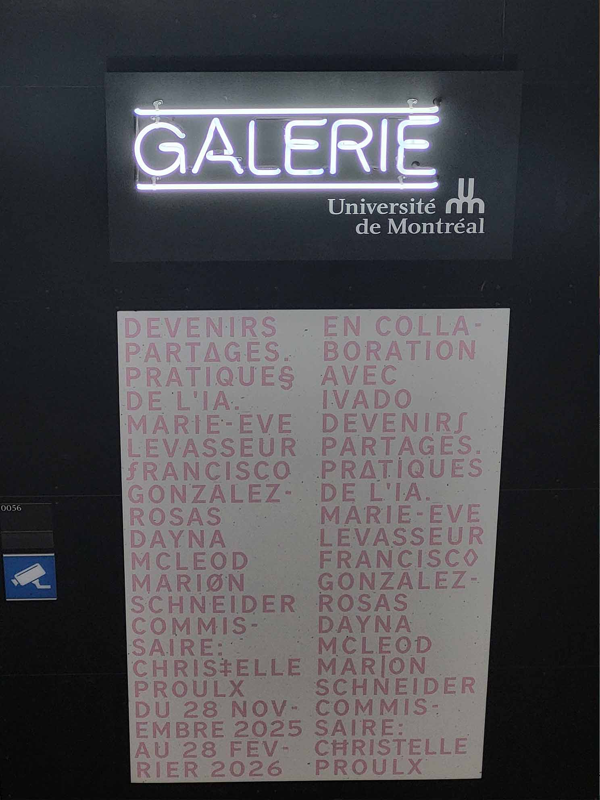
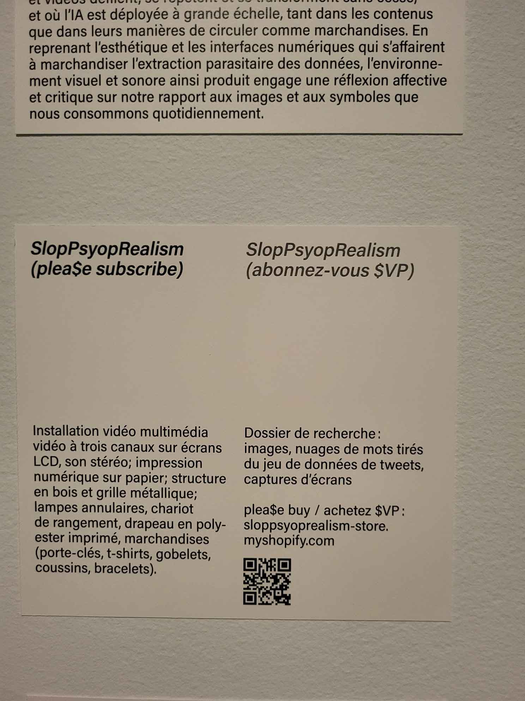

# Devenirs Ptargés - pratiques de l'IA
  
> L'affiche de l'exposition

<ins>**Lieu de mise en exposition:**</ins> Université de montréal - Pavillon de l'aménagement  

> moi devant l'entrée de l'édifice où l'exposition a lieu

<ins>**Type d'exposition:**</ins> temporaire & intérieure

<ins>**Date de visite:**</ins> 30/01/2026

<ins>**Titre de l'oeuvre:**</ins> SlopPsyopRealism (plea$esubscribe)  
  
> Photo de vue d'ensemble de l'oeuvre

<ins>**nom de l'artiste:**</ins> IVADO - Frencisco Gonzàlex-Rosas

<ins>**Année de réalisation:**:</ins> 2025

<ins>**Description de l'oeuvre:**</ins>  
  
> Cartel de l'oeuvre

<ins>**Type d'installation:**</ins> Immersive

<ins>**Mise en espace:**</ins> L'oeuvre était positionné dans le coin d'une salle avec plusieurs autres oeuvres. Sur un mur est accroché les composantes de l'oeuvre et de l'autre côté sont des éléments pour expliquer l'oeuvre et son histoire.

<ins>**Composantes et techniques:**</ins> Haut-parleurs, drapeau, peluches, chjandails, affiches, écrans, structure de bois, grille métallique, marchandises( porte-clé, T-shirt, gobelet, bracelets), lumière en cercle

<ins>**Éléments nécessaires à la mise en exposition:**</ins> Câbles, sacs pouf, Télévision, lumière projeté, écouteurs, installation vidéos, chariot de rangement

<ins>**Éxpérience vécue:**</ins> l'intéracteur est distrait par de nombreux médias. Il y a beaucoup d'éléments divers sur l'oeuvre. L'utilisateur est porté à regarder partout, à écouter et regarde les courtes vidéos.

<ins>**Ce qui m'a plu ou donné des idées**</ins> Les cercles de couleur lumineux me font penser à la roue de couleur dans les programmes de dessins.

<ins>**Aspect que je ne souhaiteriais pas retenir pour mes propres créations ou que je ferais autrement:**</ins> Je mettrais le son des haut-parleurs plus fort ou j'isolerais un peux l'oeuvre afin de bloquer le son des autres oeuvres ou des autres visiteurs dans la salle.
