# Exposition permanente
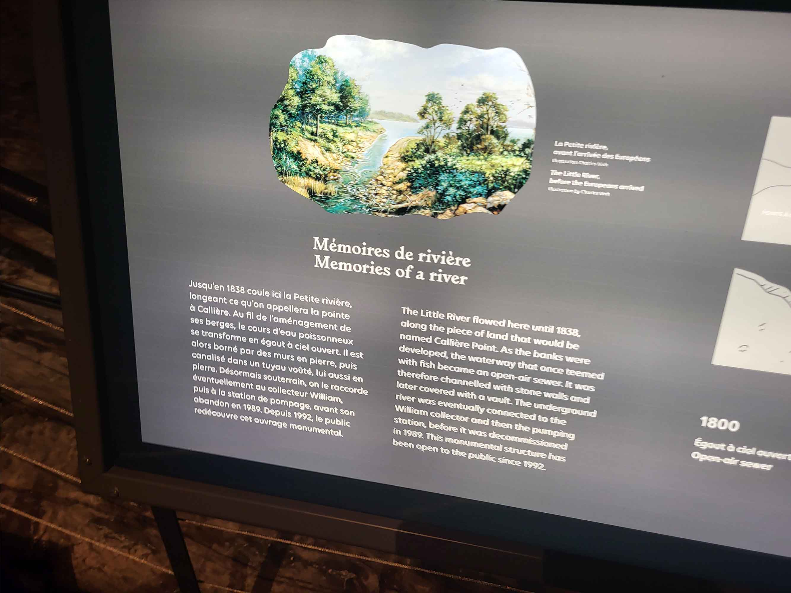 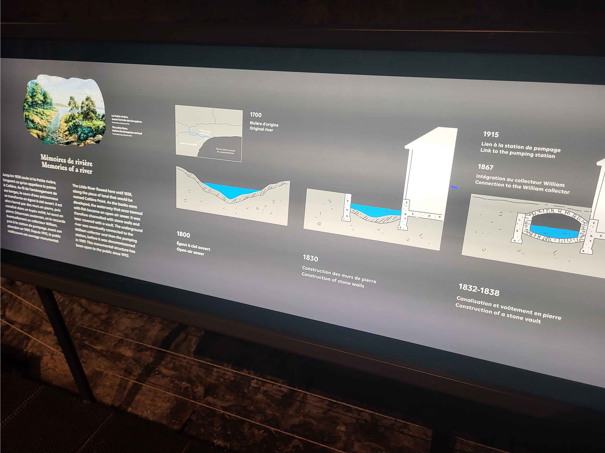  
> Texte de présentation

## <ins>**Lieu de mise en exposition:**</ins>  
Pointe-à-Callière 
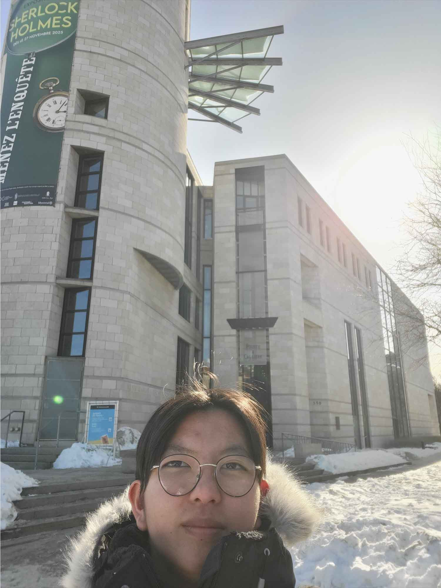  
> moi devant l'entrée de l'édifice où l'exposition a lieu

### <ins>**Type d'exposition:**</ins>  
permanente & intérieure

### <ins>**Date de visite:**</ins>  
15/02/2026

### <ins>**Titre de l'oeuvre:**</ins>  
Collecteur de mémoires   
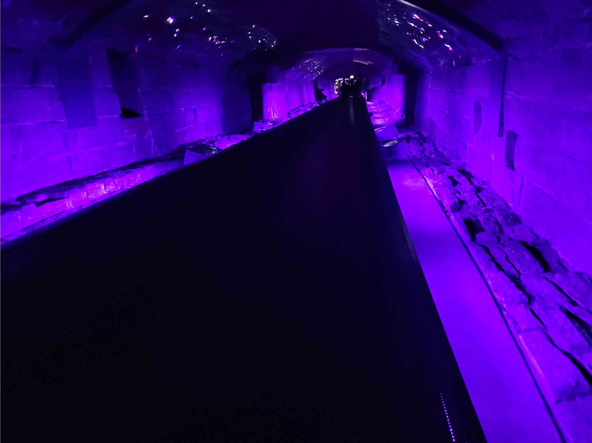  
> Photo de vue d'ensemble de l'oeuvre

### <ins>**nom de l'artiste:**</ins>
Moment Factory

### <ins>**Année de réalisation:**:</ins> 2017  

### <ins>**Description de l'oeuvre:**</ins>  
> Depuis mai 2017, les visiteurs peuvent cette fois emprunter une portion de l’égout collecteur sur une distance de 110 mètres. Ils sont appelés à vivre une expérience multisensorielle et réflexive grâce à l’installation Collecteur de mémoires, un ingénieux mécanisme de projections lumineuses sur les parois en pierre, dans un environnement sonore spécialement créé pour l’occasion.
> Dans le souci de respecter l’esprit du lieu, la mise en valeur de cet impressionnant collecteur plonge le visiteur dans un monde souterrain quasi mystérieux qui le transporte au cœur d’un espace magique porteur d’histoire et chargé d’émotions. Du jamais vu à Montréal!  
source: [Collecteur de mémoires](https://pacmusee.qc.ca/fr/expositions/detail/collecteur-de-memoires/)   
  
> Texte de présentation de l'oeuvre
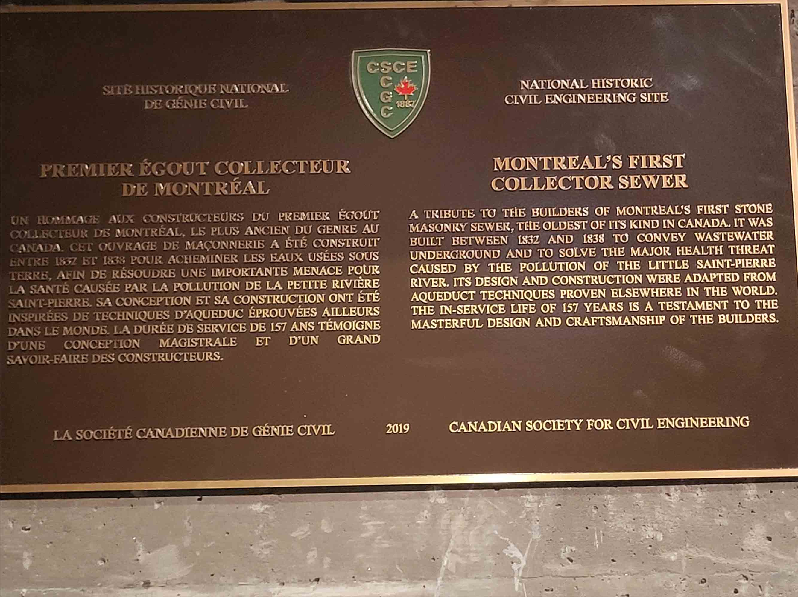  
> Photo de la plaque de certification du site historique. L'endroit est un site historique

### <ins>**Type d'installation:**</ins>  
Immersive et contemplative: Il faut se déplacer dans l'égout, observer les proejctions de lumières et il y a de la musique.    
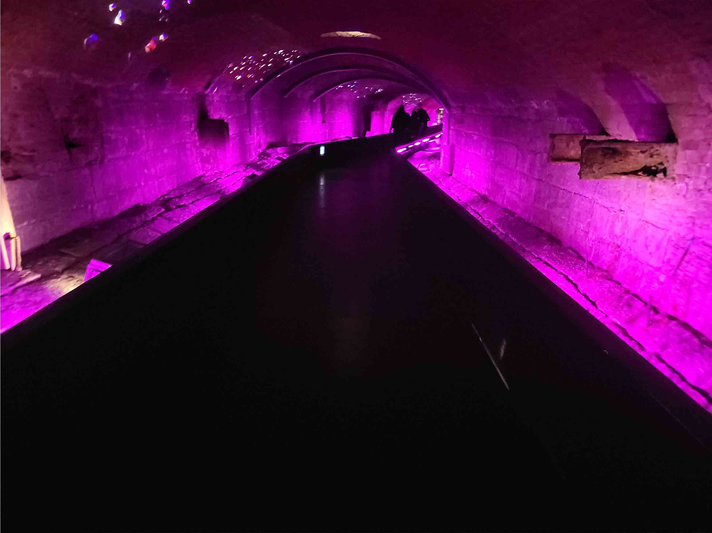  
> Vue d'ensemble de l'oeuvre

### <ins>**Fonction du dispositif multimédia:**</ins>  
 mise en valeur, les lumières et le son permettent de rendre la visite du site plus intéressantes physiquement et visuellement   
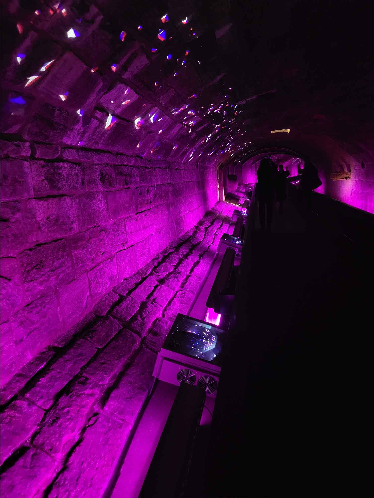  
> Photo de la parois de l'égout avec des images et de la lumière projetées

### <ins>**Mise en espace:**</ins>  
Texte qui permet de comprendre comment l'oeuvre ou le dispositif est mis en espace : dans quelle pièce, sur quel mur, quel est l'espace occupé, comment est-ce disposé... ?  Les dispositif de lumières sont placés le long du tunnel de l'égout sur les côtés de la passerrelle en métal avec les projecteurs d'effet lumineux (indiqué en vert sur le croquis). En jaune sur l'image marque le projecteur des images. Le site mesure 110m de longeur. [Information trouvées sur le site web](https://pacmusee.qc.ca/fr/expositions/detail/collecteur-de-memoires/)
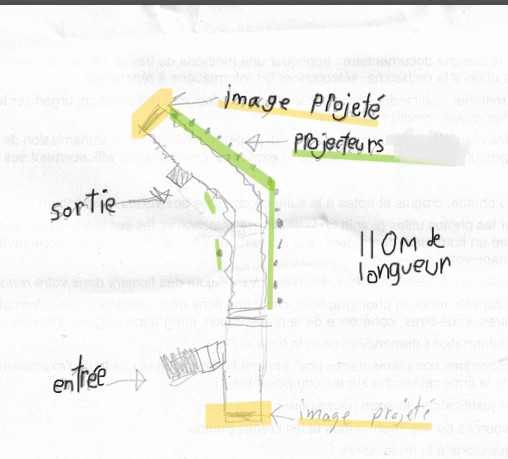  
> Croquis vue de haut de l'oeuvre

### <ins>**Composantes et techniques:**</ins>  
lumières, bandes de lumières, haut parleurs, projecteurs: 4 composantes  

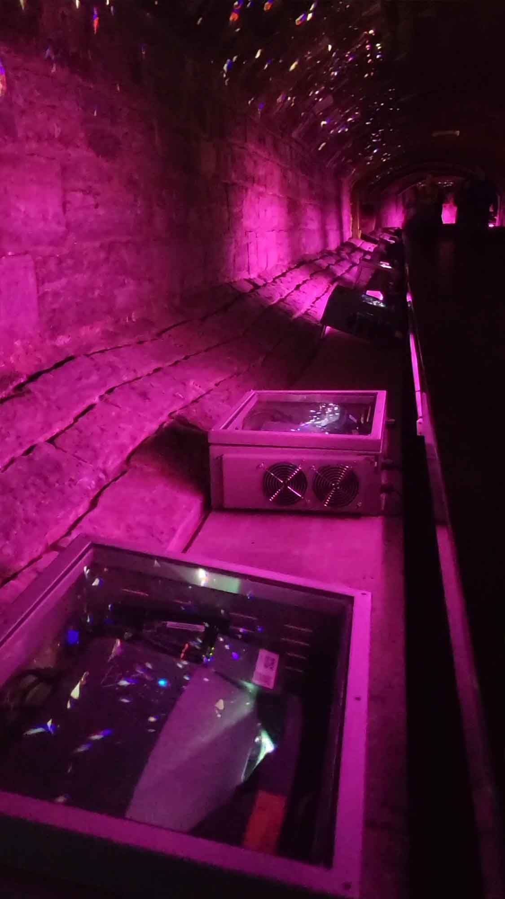  
 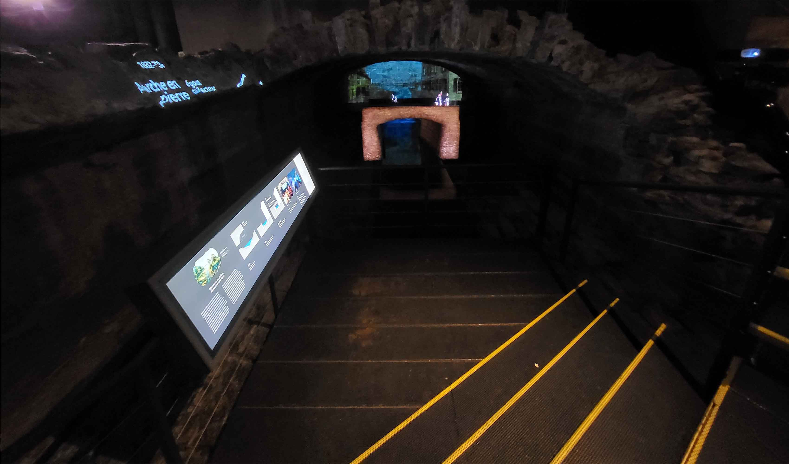 
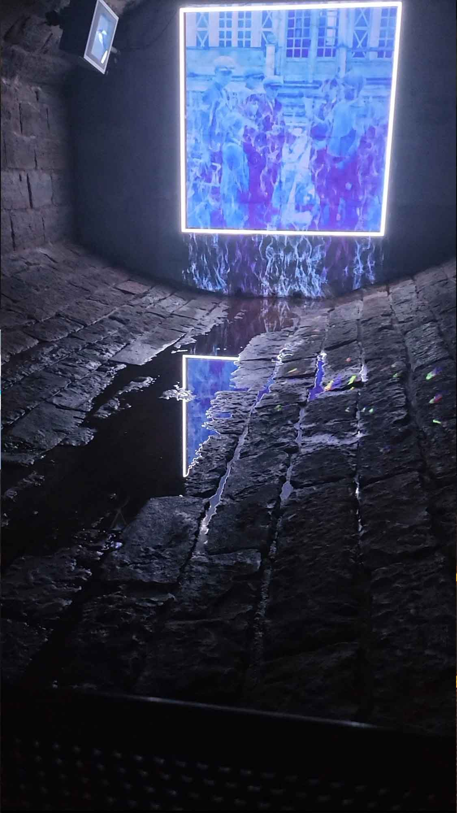    
> Plusieurs photos des composantes du dispositif

### <ins>**Éléments nécessaires à la mise en exposition:**</ins>  
L'égout, tableau lumineux pour le texte de présentation, passerelles en métal, rampes: 4 éléments  
  
  
  
> Photos des projecteurs, du tableau de présentation et du début de l'égout

### <ins>**Éxpérience vécue:**</ins>  
Il faut marcher sur la distance de l'égout, observer autour de soi, écouter la musique. La musique est très écho, l'écho donne l'impression que la musique est joué partout autour de soi tout au long de la distance. L'oeuvre est relaxante et calme. Il y a une projection à la fin et au début de l'égout.

### <ins>**Ce qui m'a plu ou donné des idées**</ins>  
La projections de lumières sur la parois de l'égout m'ont plu, ça met très bien en valeur la structure de l'égout et ses détails. Cela permet de mieux apprécier la visite du site. L'utilisation de l'écho est une très bonne idée, cela permet de donner une toute autre expérience où la musique est jouée partout autour de soi.

### <ins>**Aspect que je ne souhaiteriais pas retenir pour mes propres créations ou que je ferais autrement:**</ins>  
Les projections d'images au début et à la fin de l'égout, j'aurait éaglement mis des projections au long de l'égout. Ou j'aurais simplement enlever celle-ci et les mettres sur les parois à la place. Il ne faudrait pas trop d'images pour gêner la contemplation de l'égout mais au moins quelques une pour faire en sorte que les visiteurs s'arrêtent plus sur le chemin pour regarder.

### Références  
Toutes les photos et croquis ont étés réalisés par Jessi McMullen  
[siteweb de l'oeuvre et exposition](https://pacmusee.qc.ca/fr/expositions/detail/collecteur-de-memoires/)  
[Siteweb de l'artiste: Moment Factory](https://momentfactory.com/fr/products/collecteur-de-memoires)  
