# Nanualuk
Affiche de l'exposition

 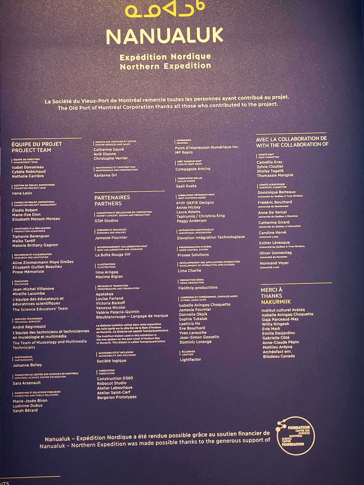  

## <ins>**Lieu de mise en exposition:**</ins>  
Centre des sciences de Montréal  
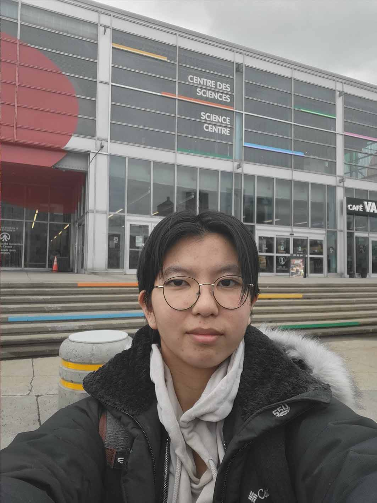  

> moi devant l'entrée de l'édifice où l'exposition a lieu

### <ins>**Type d'exposition:**</ins>  
permanente & intérieure

### <ins>**Date de visite:**</ins>  
01/04/2026

### <ins>**Titre du dispositif: Les poussins disparus**</ins>  
  
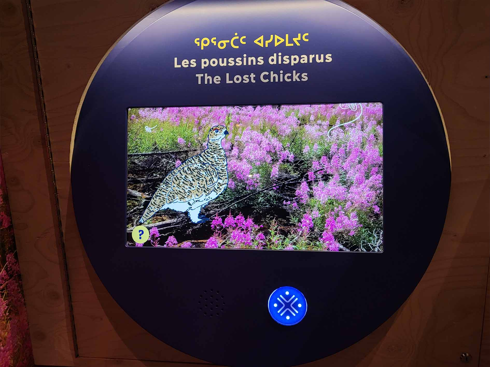  
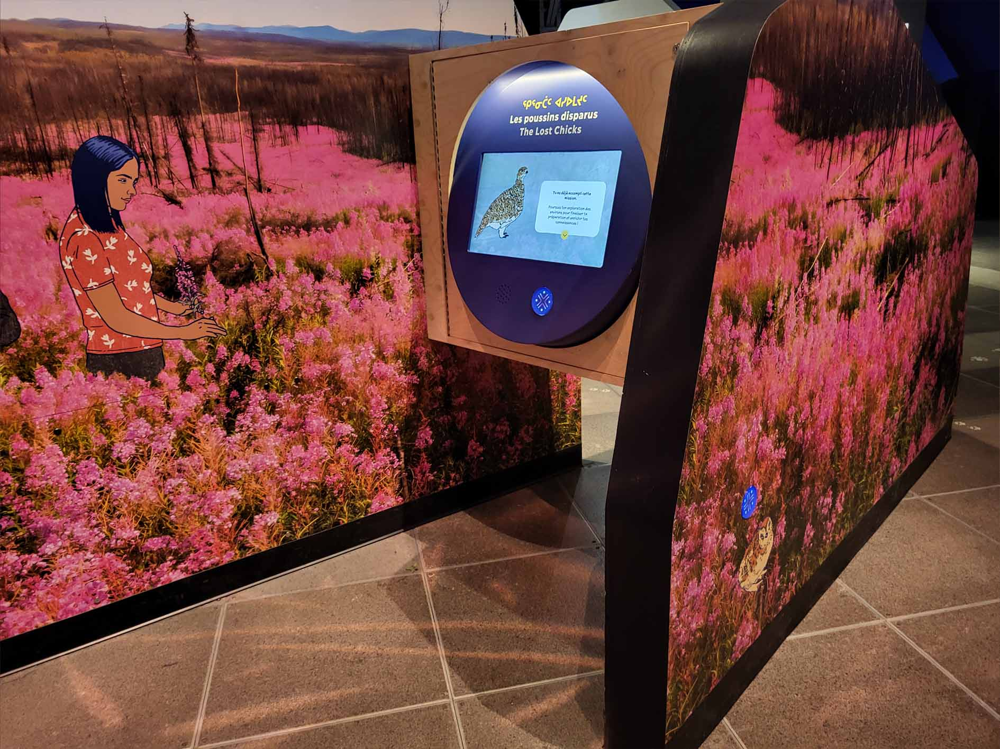  

> Photo de vue d'ensemble de l'oeuvre

### <ins>**nom de la firme: GSM Studio**</ins>  

### <ins>**Année de réalisation:**:</ins> 2025/2026  
Aucune date n'est spécifié, je suppose que c'est environ en 2025 ou 2026

### <ins>**Description du dispositif:**</ins>  
Le dispositif demande au partticipant de trouver 4 poussins éparpillés dans la salle de 'exposition et de revenir au dispositif après les avoir scannés.  
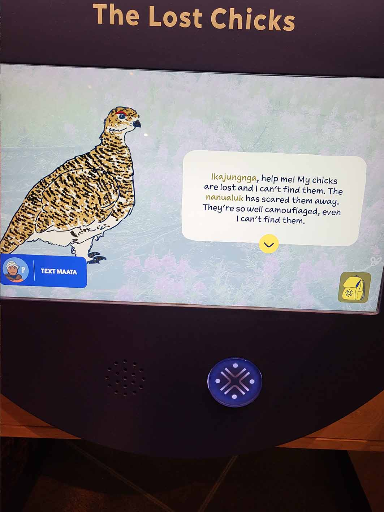

> Texte descriptif

### <ins>**Type d'installation:**</ins>  
   Intéractive  
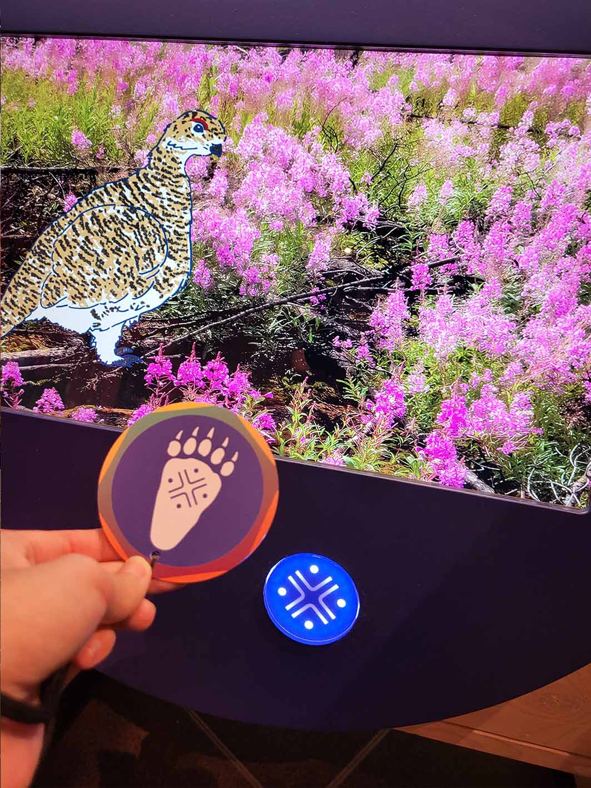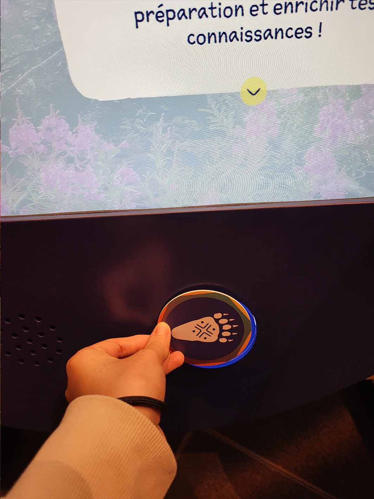  
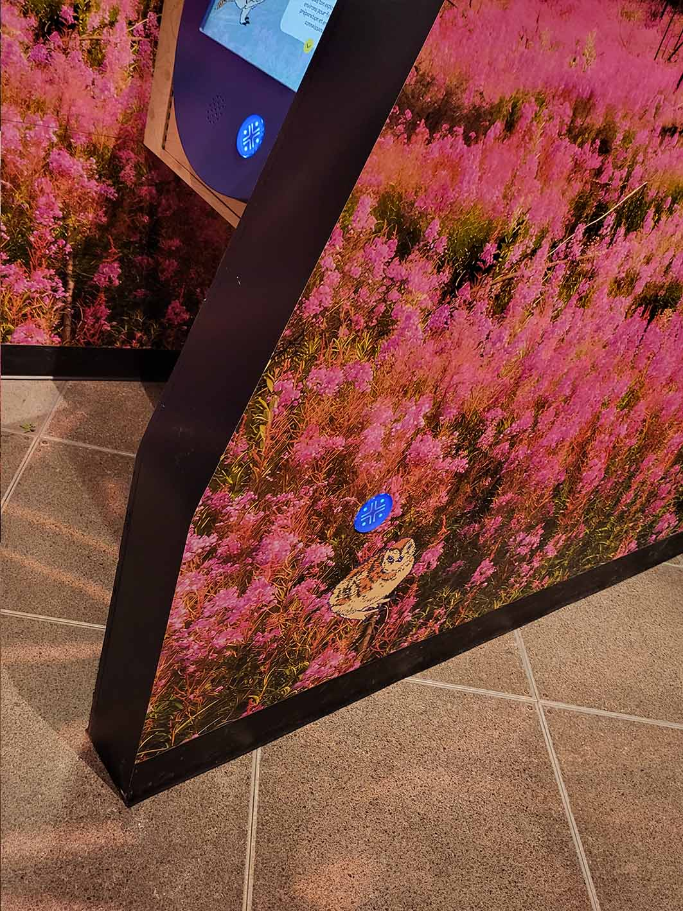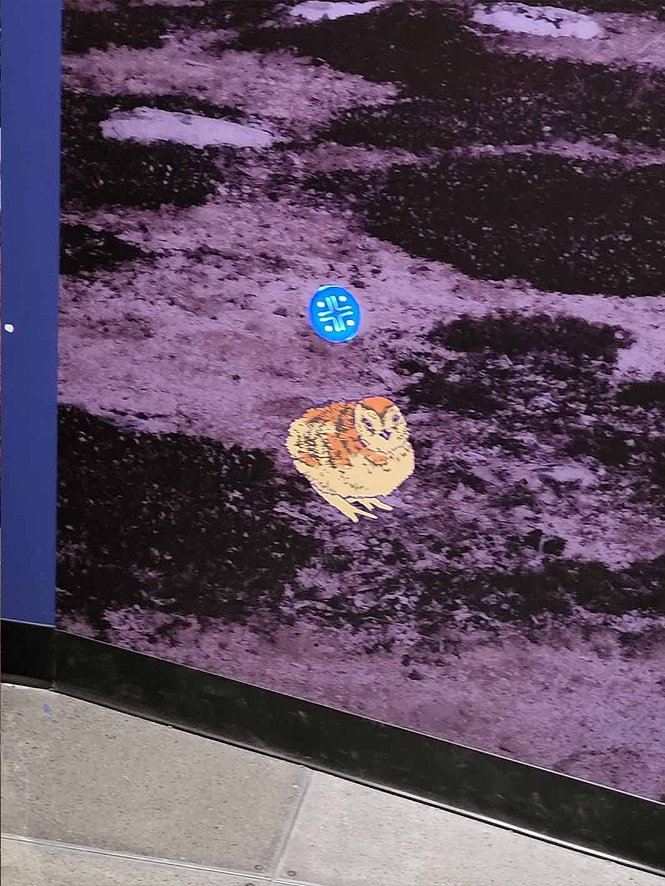   
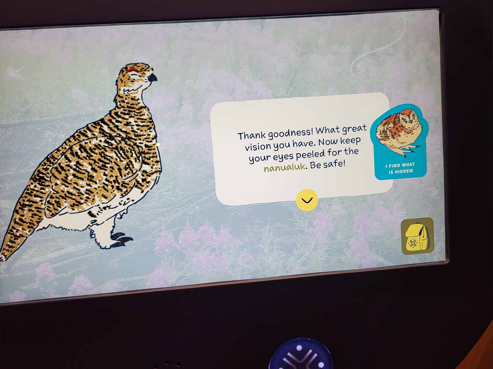 

> Photos de l'intéraction à faire et des poussins à retrouver. J'ai oublié de prendre en photo le dernier poussin qui est de l'autre côté du mur du dispositif.

### <ins>**Fonction du dispositif multimédia:**</ins>  
  Scénographique et support pédagogique  
  Scénographique car le dispositif fait parti d'un ensemble de dispositif et oeuvre où ils faut tous les visités.
  Support pédagogique car le dispositif fait apprendre des informations sur des oiseaux une fois les poussins rapportés.
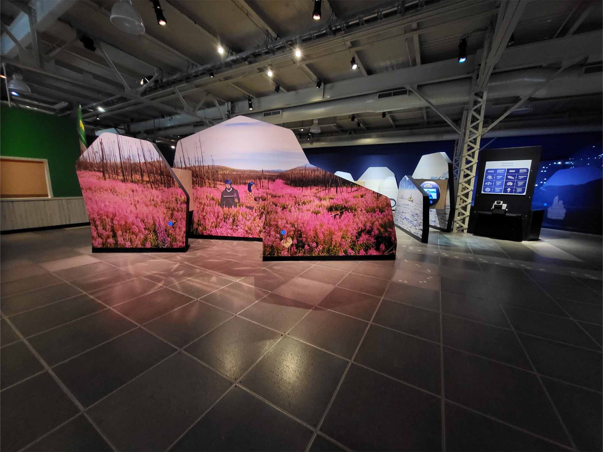  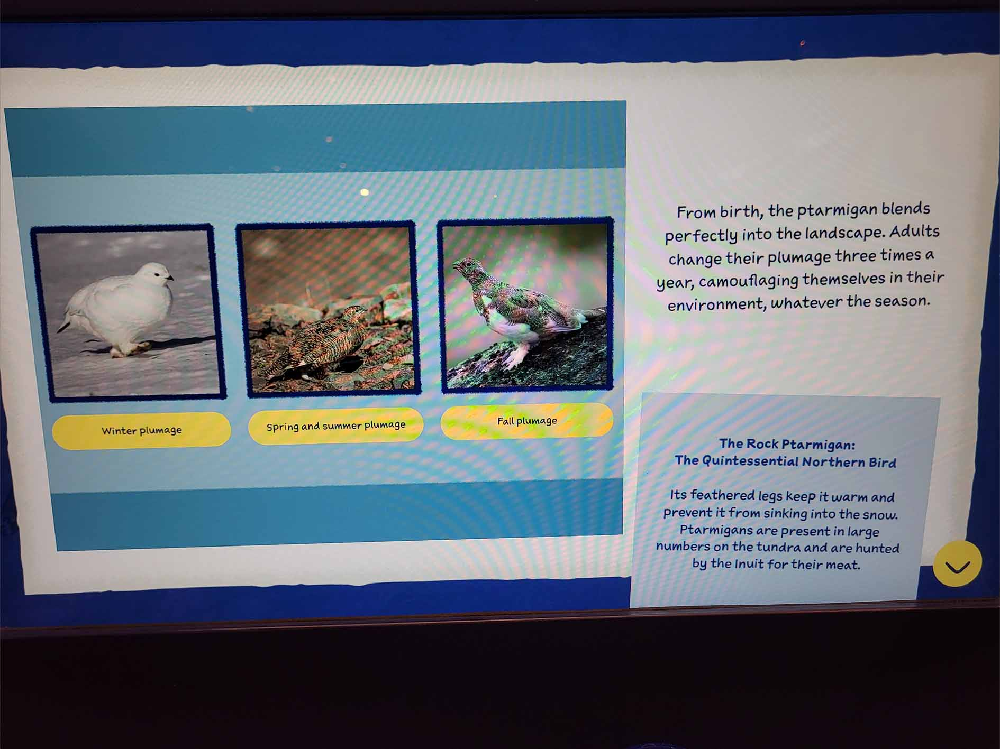  

> Photo de vue d'ensemble du dispositif et une photo de l'écran affichant des informations sur des oiseaux du nord.

### <ins>**Mise en espace:**</ins>  
CROQUIS A FAIRE.
  

> Croquis vue de haut de l'oeuvre

### <ins>**Composantes et techniques:**</ins>  
Écran, Badge à puce, Haut-parleur, Murs,  

  
  
    

> Plusieurs photos des composantes du dispositif

### <ins>**Éléments nécessaires à la mise en exposition:**</ins>  
Vidéo explication (au début de l'exposition), Murs, Salle d'exposition, Lumières

  
  
  

>

### <ins>**Éxpérience vécue:**</ins>  
J'ai fais deux fois l'expérience de ce dispositif, la première fois j'ai choisi d'expérimenter l'exposition en français, mais la deuxième fois j'ai oublié de choisir en français. Au début de l'exposition il y a une vidéo explication pour mettre en contexte et dire ce qu'il faut faire. Il y a également des badges à prendre pour garder les informations qu'on prend à chaque station, il faut tapper le badge sur un scan français ou anglais pour choisir la langue voulu. Ily a de ombreuse statiions à intéragir avec, certain sont électronique, d'autres sont fait sans électricité.

### <ins>**Ce qui m'a plu ou donné des idées**</ins>  
L'idée du dispositifs des poussins disparus m'a plu, je pense que c'est une bonne idée pour voir un aperçu de la salle d'Exposition. Le dispositif permet de découvrir les autres stations à aller voir par la suite, étant donéé qu'il est positionné au début de l'exposition.

### <ins>**Aspects que je ne souhaiteriais pas retenir pour mes propres créations ou que je ferais autrement:**</ins>  
Sans commentaire, l'exposition est simplement destiné à un autre public cible, alors l'exposition ne me convient pas tout à fait, le langage utilisé est simple, les activitis sont simple et seulement légèrement intéressantes pour moi. 

### Références  
